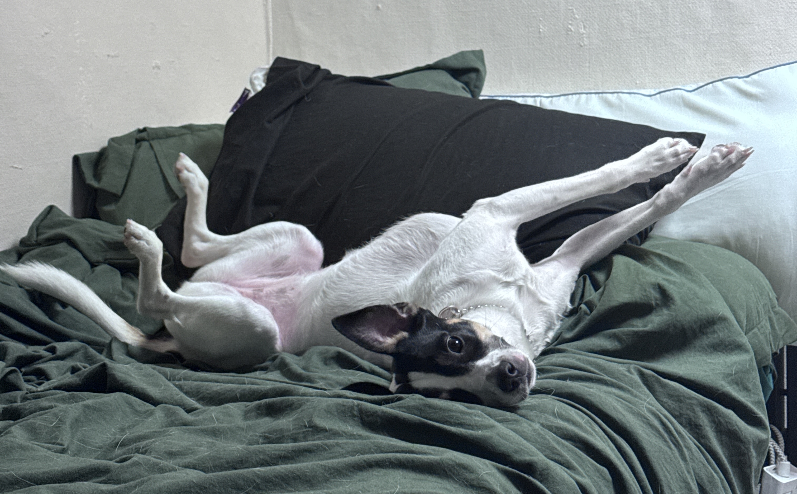

```{r setup, include=FALSE}
knitr::opts_chunk$set(echo = FALSE, warning =FALSE)
library(readr)
library(ggplot2)
library(dplyr)
```

## Dixie Ethnogram! Examining the occurance of various behaviors over the course of a couple hours. 
{width="50%"}

## Results!
```{r}
dixie<-read.csv("~/repos/Dixie/docs/app_data.csv")

behavior <- c(
  "Bed","Stare","Bed","Groom","Bed","Bed","Bed","Lick","Stare","Stare","Stare",
  "Play","Play","Play","Stare","Growl","Growl","Floor","Play","Floor","Lick",
  "Bed","Groom","Lick","Wiggle","Bed","Lick","Lick","Bed","Groom","Wiggle",
  "Groom","Play","Growl","Bed","Stare","Stare","Stare","Groom","Play","Floor",
  "Lick","Lick","Groom","Groom","Play","Growl","Play")

prompted <- c(
  "Unprompted","NA","Unprompted","NA","Unprompted","Unprompted","Unprompted","NA",
  "Unprompted","Unprompted","Unprompted","Prompted","Prompted","Prompted","Prompted",
  "Prompted","Prompted","Prompted","Prompted","Unprompted","Unprompted","Unprompted",
  "NA","Unprompted","NA","Unprompted","Unprompted","Unprompted","Unprompted","NA",
  "NA","NA","Unprompted","Unprompted","Unprompted","Unprompted","Unprompted",
  "Unprompted","NA","Unprompted","Prompted","Prompted","Unprompted","NA","NA",
  "Unprompted","Prompted","Prompted")

df<- data.frame (behavior=factor(behavior),prompted =factor(prompted)) %>% filter(behavior != "Floor")
df$prompted[df$prompted == "NA"] <- "Unprompted"
df <- df %>%
  mutate(behavior = recode(behavior, "Bed" = "Whine"))


ggplot(df, aes(x=behavior))+geom_bar()+labs(title= 'Dixie Behaviors', x='Behavior', y= 'Count')+scale_y_continuous(breaks= seq(0,20, by = 1))
```

## Example of "wiggle"
{width="75%"}

## Was she provoked?
```{r}
ggplot(df, aes(x= behavior, fill=prompted))+geom_bar()+labs(title= 'What was prompted?', x='Behavior', y= 'Count', fill = 'Prompted')+scale_y_continuous(breaks= seq(0,20, by = 1))
```


## Timeline 
```{r}
#fix time
dixie$time <- as.POSIXct(
  dixie$X2026.04.19.13.21.27,
  format = "%Y-%m-%d %H:%M:%S"
)
#filter +clean
dixie <- dixie[dixie$time < as.POSIXct("2026-04-20"), ]
dixie$Bed[dixie$Bed == "Bed"] <- "Whine"


ggplot(dixie, aes(x = time, y = Bed, color = Bed)) +
  geom_point(size = 3) +
  labs(x = "Time", y = "Behavior", color = "Action") +
  theme_minimal() + scale_x_datetime(date_breaks = "30 min", date_labels = "%H:%M")


```
